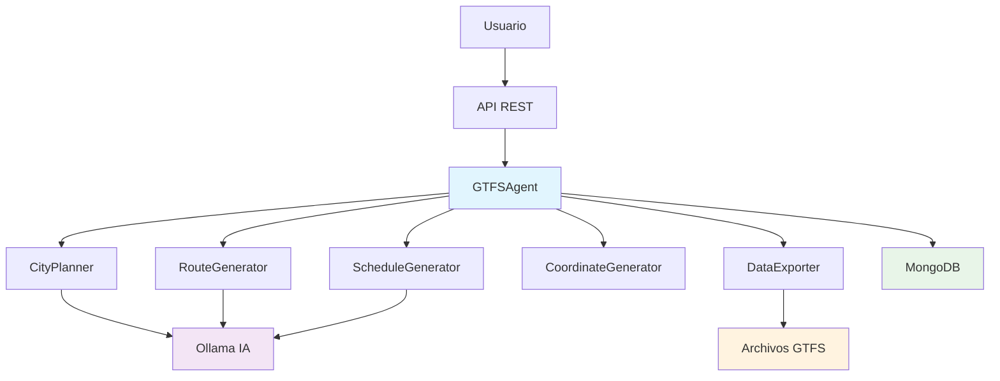
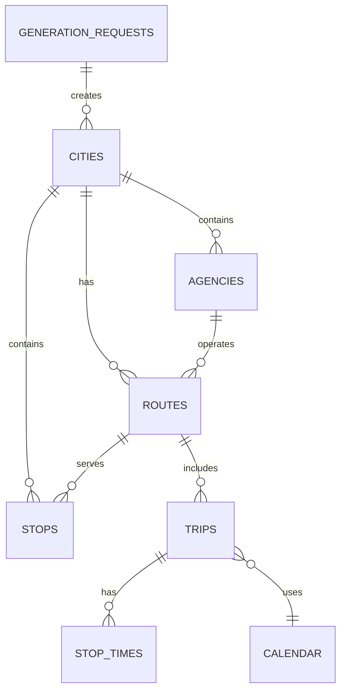

# 🚌 GTFS AI Generator

> **Generador inteligente de datos de transporte público usando IA**

Un sistema avanzado que utiliza inteligencia artificial (LangChain.js + Ollama) para generar automáticamente datos GTFS (General Transit Feed Specification) realistas y coherentes para ciudades ficticias. Perfecto para testing, desarrollo y demos de aplicaciones de transporte.

## 🎯 ¿Qué es GTFS?

GTFS (General Transit Feed Specification) es un estándar abierto que define cómo se estructuran los datos de transporte público. Es utilizado por Google Maps, Apple Maps, y miles de aplicaciones de transporte en todo el mundo.

## 🚀 Características Principales

### 🧠 **Inteligencia Artificial Avanzada**
- **Modelos locales**: Usa Ollama con llama3.1:8b (sin dependencias externas)
- **LangChain.js**: Framework robusto para aplicaciones de IA
- **Generación coherente**: Datos que siguen patrones urbanos reales
- **Personalizable**: Parámetros ajustables para diferentes tipos de ciudades

### 🗺️ **Integración con OpenStreetMap (NUEVO)**
- **Rutas reales**: Shapes que siguen calles existentes usando OSRM
- **Geocoding avanzado**: Conversión de direcciones a coordenadas con múltiples candidatos
- **Score de confianza**: Algoritmo inteligente para evaluar precisión de resultados
- **Búsqueda con filtros**: Geocoding con filtros por país, tipo de lugar, etc.
- **Routing inteligente**: Cálculo de rutas óptimas entre puntos
- **IA híbrida**: Combina datos reales de OSM con lógica de IA
- **Shapes GTFS**: Generación de geometrías compatibles con estándares

### 🏙️ **Generación Realista de Ciudades**
- **Layout urbano inteligente**: Zonas comerciales, residenciales, industriales
- **Puntos de interés**: Estaciones, hospitales, universidades, centros comerciales
- **Rutas lógicas**: Conexiones que un planificador urbano aprobaría
- **Geografía creíble**: Coordenadas que forman redes de transporte coherentes

### 🚌 **Múltiples Tipos de Transporte**
- **Metro/Subway**: Líneas subterráneas con alta frecuencia
- **Autobús**: Rutas de superficie con paradas estratégicas
- **Tranvía**: Sistemas de riel ligero
- **Ferry**: Transporte acuático
- **Y más**: Cable car, funicular, monorail, etc.

### ⏰ **Horarios Inteligentes**
- **Frecuencias realistas**: Mayor frecuencia en horas pico
- **Horarios de servicio**: Diferentes para días laborables y fines de semana
- **Tiempos de viaje**: Basados en distancias y tipo de transporte
- **Paradas estratégicas**: Tiempos de permanencia apropiados

### 📊 **Base de Datos Robusta**
- **MongoDB**: Almacenamiento escalable y flexible
- **Mongoose ODM**: Modelado de datos con validaciones
- **Índices optimizados**: Consultas rápidas y eficientes
- **Relaciones**: Datos conectados lógicamente

### 🔌 **API REST Completa**
- **Generación**: Crear ciudades completas con un solo endpoint
- **Consulta**: Acceder a datos específicos
- **Exportación**: Descargar archivos GTFS listos para usar
- **Administración**: Gestionar ciudades y solicitudes
- **OSM Integration**: Endpoints para rutas realistas con OpenStreetMap

### 📁 **Exportación GTFS Estándar**
- **Archivos CSV**: Compatibles con cualquier herramienta GTFS
- **Archivos ZIP**: Paquetes listos para distribución
- **Validación**: Cumple especificaciones GTFS oficiales
- **Múltiples formatos**: CSV, JSON, ZIP

## 🏗️ Arquitectura del Sistema

### Componentes Principales



### Flujo de Generación

1. **📝 Entrada**: Usuario envía parámetros de ciudad
2. **🏙️ Planificación**: CityPlanner diseña estructura urbana
3. **🗺️ Coordenadas**: CoordinateGenerator crea geografía realista
4. **🚌 Rutas**: RouteGenerator planifica conexiones lógicas
5. **⏰ Horarios**: ScheduleGenerator crea tiempos coherentes
6. **💾 Almacenamiento**: Datos guardados en MongoDB
7. **📤 Exportación**: DataExporter genera archivos GTFS

## 📁 Estructura del Proyecto

```
gtfs-ai-generator/
├── 📂 src/                          # Código fuente principal
│   ├── 📄 app.js                    # Aplicación Express principal
│   ├── 📂 config/                   # Configuraciones del sistema
│   │   ├── database.js              # Conexión y configuración MongoDB
│   │   ├── logger.js                # Sistema de logging con Winston
│   │   ├── errorHandler.js          # Manejo centralizado de errores
│   │   └── local.js                 # Configuración para desarrollo local
│   ├── 📂 controllers/              # Controladores de la API REST
│   │   ├── cityController.js        # Gestión completa de ciudades
│   │   ├── gtfsController.js        # Consultas y exportación GTFS
│   │   └── generationController.js  # Generación individual de componentes
│   ├── 📂 models/                   # Modelos de datos MongoDB
│   │   ├── City.js                  # Modelo de ciudad con metadatos
│   │   ├── Agency.js                # Modelo de agencia de transporte
│   │   ├── Route.js                 # Modelo de ruta con geometría
│   │   ├── Stop.js                  # Modelo de parada con coordenadas
│   │   └── GenerationRequest.js     # Modelo de solicitud con logs
│   ├── 📂 generators/               # Generadores de IA
│   │   ├── GTFSAgent.js             # Orquestador principal del sistema
│   │   ├── CityPlanner.js           # Planificador urbano con IA
│   │   ├── RouteGenerator.js        # Generador de rutas lógicas
│   │   ├── ScheduleGenerator.js     # Generador de horarios realistas
│   │   ├── CoordinateGenerator.js   # Generador de geografía coherente
│   │   └── DataExporter.js          # Exportador a formato GTFS
│   ├── 📂 services/                 # Servicios de negocio
│   │   ├── osmService.js            # Integración con OpenStreetMap
│   │   └── shapeGenerator.js        # Generador híbrido IA + OSM
├── 📂 scripts/                      # Scripts de utilidad y administración
│   ├── dev-setup.ps1                # Configuración automática de desarrollo
│   ├── init-ollama.sh               # Inicialización de modelos Ollama
│   ├── mongodb-queries.js           # Consultas útiles de MongoDB
│   └── mongodb-admin.js             # Herramientas de administración
├── 📂 generated-gtfs/               # Archivos GTFS generados
│   └── .gitkeep                     # Mantiene la carpeta en Git
├── 📂 mongo-init/                   # Inicialización de MongoDB
│   └── init.js                      # Script de creación de colecciones e índices
├── 📂 docs/                         # Documentación adicional
├── 📂 .vscode/                      # Configuración de VS Code
│   └── extensions.json              # Extensiones recomendadas
├── 🐳 docker-compose.yml            # Configuración de servicios Docker
├── 🐳 Dockerfile                    # Imagen de la aplicación Node.js
├── 📦 package.json                  # Dependencias y scripts de Node.js
├── ⚙️ .env.example                  # Plantilla de variables de entorno
├── 📋 .gitignore                    # Archivos ignorados por Git
├── 📖 README.md                     # Este archivo
├── 📄 LICENSE                       # Licencia MIT
├── 🔧 .eslintrc.js                  # Configuración de ESLint
└── 🔄 nodemon.json                  # Configuración de Nodemon
```

## 🛠️ Instalación y Configuración

### 📋 Prerrequisitos

| Requisito | Descripción | Opcional |
|-----------|-------------|----------|
| **Docker Desktop** | Para contenedores de MongoDB y la aplicación | ❌ Requerido |
| **Node.js 18+** | Para desarrollo local y scripts | ✅ Recomendado |
| **Ollama** | Para modelos de IA locales | ❌ Requerido |
| **8GB+ RAM** | Para ejecutar modelos de IA | ✅ Recomendado |
| **GPU** | Para mejor rendimiento de IA | ✅ Opcional |

### 🚀 Instalación Rápida

#### 1. **Clonar el repositorio**
```bash
git clone https://github.com/ai-ragare/gtfs-ai-generator.git
cd gtfs-ai-generator
```

#### 2. **Configurar variables de entorno**
```bash
# Copiar plantilla de configuración
cp env.example .env

# Editar configuración (usar tu editor favorito)
notepad .env  # Windows
# o
nano .env     # Linux/Mac
```

#### 3. **Configuración mínima en .env**
```bash
# ===== CONFIGURACIÓN BÁSICA =====
NODE_ENV=development
PORT=3000

# ===== MONGODB =====
MONGO_ROOT_USERNAME=admin
MONGO_ROOT_PASSWORD=password123
MONGO_DATABASE=gtfs_generator

# ===== OLLAMA (IA LOCAL) =====
OLLAMA_BASE_URL=http://localhost:11434
OLLAMA_MODEL=llama3.1:8b
OLLAMA_TEMPERATURE=0.7
OLLAMA_MAX_TOKENS=4000

# ===== OPCIONAL: OPENAI COMO RESPALDO =====
OPENAI_API_KEY=sk-your-openai-api-key-here

# ===== INTEGRACIÓN OPENSTREETMAP =====
OSRM_BASE_URL=http://router.project-osrm.org
NOMINATIM_BASE_URL=https://nominatim.openstreetmap.org
OSM_USER_AGENT=gtfs-ai-generator/1.0
DEFAULT_ROUTING_PROFILE=driving
MAX_WAYPOINTS=25
ROUTING_TIMEOUT=30000
```

### 🐳 Instalación con Docker (Recomendado)

#### **Opción A: Todo en Docker**
```bash
# 1. Iniciar todos los servicios
docker-compose up -d

# 2. Verificar que todo esté funcionando
docker-compose ps

# 3. Ver logs
docker-compose logs -f
```

#### **Opción B: Híbrido (Ollama local + Docker)**
```bash
# 1. Instalar Ollama localmente
# Descargar desde: https://ollama.ai/

# 2. Descargar modelo
ollama pull llama3.1:8b

# 3. Iniciar solo MongoDB y la app
docker-compose up -d mongodb mongo-express app
```

### 💻 Instalación para Desarrollo Local

#### **1. Instalar Node.js**
- Descargar desde: https://nodejs.org/
- Versión LTS recomendada (20.x)

#### **2. Instalar dependencias**
```bash
npm install
```

#### **3. Configurar desarrollo**
```bash
# Ejecutar script de configuración automática
npm run setup

# O manualmente:
npm install
```

#### **4. Iniciar en modo desarrollo**
```bash
# Desarrollo con recarga automática
npm run dev

# O con variables de entorno específicas
npm run dev:local
```

## 🚀 Uso del Sistema

### 📊 Servicios Disponibles

Una vez iniciado el sistema, tendrás acceso a:

| Servicio | URL | Descripción |
|----------|-----|-------------|
| **API Principal** | http://localhost:3000 | API REST para generación y consulta |
| **MongoDB Express** | http://localhost:8081 | Interfaz web para MongoDB |
| **Ollama API** | http://localhost:11434 | API de modelos de IA locales |

### 🔧 Comandos de Gestión

#### **Docker (Producción)**
```bash
# Iniciar todos los servicios
docker-compose up -d

# Ver estado de contenedores
docker-compose ps

# Ver logs en tiempo real
docker-compose logs -f

# Reiniciar un servicio específico
docker-compose restart app

# Detener todos los servicios
docker-compose down

# Detener y eliminar volúmenes (CUIDADO: elimina datos)
docker-compose down -v
```

#### **Desarrollo Local**
```bash
# Instalar dependencias
npm install

# Desarrollo con recarga automática
npm run dev

# Ejecutar tests
npm test

# Linting del código
npm run lint

# Corregir errores de linting automáticamente
npm run lint:fix

# Configuración automática del proyecto
npm run setup
```

#### **Administración de Base de Datos**
```bash
# Ver consultas básicas de MongoDB
npm run db:queries

# Herramientas de administración
npm run db:admin

# Limpiar base de datos
npm run db:clear

# Crear backup
npm run db:backup

# Optimizar base de datos
npm run db:optimize
```

## 🔌 API REST - Documentación Completa

### 🏙️ **Generación de Ciudades**

#### **Generar Ciudad Completa**
```http
POST /api/cities/generate
Content-Type: application/json

{
  "cityName": "Valencia Ejemplo",
  "citySize": "medium",
  "cityType": "mixed",
  "populationDensity": "high",
  "transportTypes": ["bus", "subway", "tram"],
  "numberOfRoutes": 15,
  "operatingHours": {
    "start": "05:00",
    "end": "23:30"
  },
  "touristAreas": true,
  "industrialZones": true,
  "language": "es"
}
```

**Respuesta:**
```json
{
  "success": true,
  "message": "Generación de ciudad iniciada",
  "data": {
    "city_id": "city_1234567890",
    "request_id": "req_1234567890",
    "status": "processing",
    "estimated_completion": "2025-01-01T12:00:00.000Z"
  }
}
```

#### **Listar Ciudades**
```http
GET /api/cities?page=1&limit=10&status=completed&city_size=medium
```

#### **Obtener Ciudad Específica**
```http
GET /api/cities/city_1234567890
```

#### **Vista Previa de Datos**
```http
GET /api/cities/city_1234567890/preview
```

#### **Exportar GTFS**
```http
GET /api/cities/city_1234567890/export?format=zip
```

#### **Eliminar Ciudad**
```http
DELETE /api/cities/city_1234567890
```

### 📊 **Consulta de Datos GTFS**

#### **Listar Agencias**
```http
GET /api/gtfs/agencies
```

#### **Listar Rutas**
```http
GET /api/gtfs/routes?agency_id=agency_1&route_type=1
```

#### **Listar Paradas**
```http
GET /api/gtfs/stops?location_type=0&lat=19.4326&lon=-99.1332&radius=5
```

#### **Exportar Datos**
```http
GET /api/gtfs/export?format=csv
```

### 🔧 **Generación Individual (Legacy)**

#### **Generar Agencia**
```http
POST /api/generate/agency
Content-Type: application/json

{
  "name": "Metro de la Ciudad",
  "description": "Sistema de metro urbano",
  "city": "Ciudad de México",
  "country": "México"
}
```

#### **Generar Rutas**
```http
POST /api/generate/routes
Content-Type: application/json

{
  "agency_id": "agency_123",
  "route_count": 5,
  "route_types": ["subway", "bus"]
}
```

#### **Generar Paradas**
```http
POST /api/generate/stops
Content-Type: application/json

{
  "stop_count": 20,
  "city_center": {
    "lat": 19.4326,
    "lon": -99.1332
  }
}
```

### 🗺️ **Integración OpenStreetMap (NUEVO)**

#### **Generar Ruta Realista**
```http
POST /api/osm/generate-realistic-route
Content-Type: application/json

{
  "origin": "Valencia, Estación Central",
  "destination": "Gandía, Estación de Tren",
  "intermediateStops": ["Alzira Centro", "Sueca Ayuntamiento"],
  "frequency": 30,
  "serviceHours": {
    "start": "06:00",
    "end": "22:00"
  },
  "transportType": "bus",
  "route_short_name": "L1",
  "route_long_name": "Valencia - Gandía",
  "capacity": 50
}
```

#### **Mejorar Ruta Existente**
```http
POST /api/osm/improve-route/route_123
Content-Type: application/json

{
  "route_id": "route_123",
  "stops": [
    {
      "stop_id": "stop_1",
      "stop_lat": 40.4168,
      "stop_lon": -3.7038
    }
  ]
}
```

#### **Geocoding y Routing**
```http
# Geocoding simple
GET /api/osm/geocode?address=Madrid, España

# Geocoding con múltiples candidatos (NUEVO)
GET /api/osm/geocode-candidates?address=Valencia&limit=5

# Búsqueda avanzada con filtros (NUEVO)
POST /api/osm/advanced-search
{
  "query": "estación central",
  "filters": {
    "limit": 5,
    "country": "es"
  }
}

# Reverse Geocoding
GET /api/osm/reverse-geocode?lat=40.4168&lon=-3.7038

# Calcular ruta
POST /api/osm/route
{
  "coordinates": [
    { "lat": 40.4168, "lon": -3.7038 },
    { "lat": 40.4200, "lon": -3.7100 }
  ]
}

# Health Check OSM
GET /api/osm/health
```

### 📋 **Parámetros de Generación**

| Parámetro | Tipo | Descripción | Valores |
|-----------|------|-------------|---------|
| `cityName` | string | Nombre de la ciudad | Cualquier string |
| `citySize` | string | Tamaño de la ciudad | `small`, `medium`, `large`, `mega` |
| `cityType` | string | Tipo de ciudad | `tourist`, `industrial`, `residential`, `mixed` |
| `populationDensity` | string | Densidad poblacional | `low`, `medium`, `high` |
| `transportTypes` | array | Tipos de transporte | `["bus", "subway", "tram", "ferry"]` |
| `numberOfRoutes` | number | Número de rutas | 1-100 |
| `operatingHours` | object | Horarios de operación | `{start: "05:00", end: "23:30"}` |
| `touristAreas` | boolean | Incluir áreas turísticas | `true`/`false` |
| `industrialZones` | boolean | Incluir zonas industriales | `true`/`false` |
| `language` | string | Idioma para nombres | `es`, `en`, `fr`, etc. |

## 💡 Ejemplos de Uso

### 🏙️ **Generar una Ciudad Completa**

```bash
# Usando curl
curl -X POST http://localhost:3000/api/cities/generate \
  -H "Content-Type: application/json" \
  -d '{
    "cityName": "Valencia Ejemplo",
    "citySize": "medium",
    "cityType": "mixed",
    "populationDensity": "high",
    "transportTypes": ["bus", "subway", "tram"],
    "numberOfRoutes": 15,
    "operatingHours": {
      "start": "05:00",
      "end": "23:30"
    },
    "touristAreas": true,
    "industrialZones": true,
    "language": "es"
  }'
```

```powershell
# Usando PowerShell
$body = @{
    cityName = "Valencia Ejemplo"
    citySize = "medium"
    cityType = "mixed"
    populationDensity = "high"
    transportTypes = @("bus", "subway", "tram")
    numberOfRoutes = 15
    operatingHours = @{
        start = "05:00"
        end = "23:30"
    }
    touristAreas = $true
    industrialZones = $true
    language = "es"
} | ConvertTo-Json

Invoke-WebRequest -Uri "http://localhost:3000/api/cities/generate" -Method POST -Body $body -ContentType "application/json"
```

### 📊 **Consultar Datos**

```bash
# Listar todas las ciudades
curl http://localhost:3000/api/cities

# Obtener vista previa de una ciudad específica
curl http://localhost:3000/api/cities/city_1234567890/preview

# Listar rutas de una ciudad
curl "http://localhost:3000/api/gtfs/routes?city_id=city_1234567890"

# Buscar paradas cerca de una ubicación
curl "http://localhost:3000/api/gtfs/stops?lat=19.4326&lon=-99.1332&radius=5"
```

### 📤 **Exportar Datos**

```bash
# Exportar GTFS como ZIP
curl "http://localhost:3000/api/cities/city_1234567890/export?format=zip" -o ciudad.zip

# Exportar datos como CSV
curl "http://localhost:3000/api/gtfs/export?format=csv" -o datos.csv
```

### 🗺️ **Usar Integración OSM**

```bash
# Generar ruta realista
curl -X POST http://localhost:3000/api/osm/generate-realistic-route \
  -H "Content-Type: application/json" \
  -d '{
    "origin": "Valencia, Estación Central",
    "destination": "Gandía, Estación de Tren",
    "intermediateStops": ["Alzira Centro", "Sueca Ayuntamiento"],
    "frequency": 30,
    "transportType": "bus"
  }'

# Geocodificar dirección simple
curl "http://localhost:3000/api/osm/geocode?address=Madrid, España"

# Geocodificar con múltiples candidatos (NUEVO)
curl "http://localhost:3000/api/osm/geocode-candidates?address=Valencia&limit=5"

# Búsqueda avanzada con filtros (NUEVO)
curl -X POST http://localhost:3000/api/osm/advanced-search \
  -H "Content-Type: application/json" \
  -d '{
    "query": "estación central",
    "filters": {"limit": 5, "country": "es"}
  }'

# Verificar salud de servicios OSM
curl http://localhost:3000/api/osm/health
```

## 🗄️ Estructura de la Base de Datos

### 📊 **Colecciones Principales**

| Colección | Descripción | Campos Clave |
|-----------|-------------|--------------|
| **cities** | Información de ciudades generadas | `city_id`, `city_name`, `city_size`, `transport_types` |
| **generation_requests** | Solicitudes con logs detallados | `request_id`, `status`, `logs`, `created_at` |
| **agencies** | Agencias de transporte | `agency_id`, `agency_name`, `city_id` |
| **routes** | Rutas con geometría | `route_id`, `route_short_name`, `route_type` |
| **stops** | Paradas con coordenadas | `stop_id`, `stop_name`, `stop_lat`, `stop_lon` |
| **trips** | Viajes programados | `trip_id`, `route_id`, `service_id` |
| **stop_times** | Horarios detallados | `trip_id`, `stop_id`, `arrival_time` |
| **calendar** | Calendarios de servicio | `service_id`, `monday`, `tuesday`, etc. |

### 🔗 **Relaciones entre Colecciones**



### 📈 **Índices Optimizados**

```javascript
// Índices principales para consultas rápidas
db.cities.createIndex({ "city_id": 1 }, { unique: true })
db.routes.createIndex({ "city_id": 1, "route_type": 1 })
db.stops.createIndex({ "city_id": 1, "location": "2dsphere" })
db.stop_times.createIndex({ "trip_id": 1, "stop_sequence": 1 })
```

## 🔒 Seguridad y Mejores Prácticas

### 🛡️ **Medidas de Seguridad Implementadas**

- **Rate Limiting**: Límite de 100 requests por minuto por IP
- **Validación de Entrada**: Joi para validar todos los parámetros
- **Sanitización**: Limpieza automática de datos de entrada
- **Headers de Seguridad**: Helmet.js para headers HTTP seguros
- **CORS**: Configuración restrictiva de orígenes permitidos
- **Logging**: Winston para auditoría completa de operaciones
- **Variables de Entorno**: Credenciales sensibles fuera del código
- **Usuario no-root**: Contenedores Docker con usuario limitado

### 🔐 **Configuración de Seguridad**

```javascript
// Rate limiting
const limiter = rateLimit({
  windowMs: 15 * 60 * 1000, // 15 minutos
  max: 100, // máximo 100 requests por IP
  message: 'Demasiadas solicitudes desde esta IP'
});

// CORS
app.use(cors({
  origin: process.env.ALLOWED_ORIGINS?.split(',') || ['http://localhost:3000'],
  credentials: true
}));

// Helmet
app.use(helmet({
  contentSecurityPolicy: {
    directives: {
      defaultSrc: ["'self'"],
      styleSrc: ["'self'", "'unsafe-inline'"]
    }
  }
}));
```

## 📈 Monitoreo y Logging

### 📊 **Sistema de Logging**

- **Winston**: Logs estructurados con diferentes niveles
- **Rotación**: Archivos de log con rotación automática
- **Formato**: JSON para fácil parsing y análisis
- **Niveles**: error, warn, info, debug

### 📈 **Métricas Disponibles**

- Tiempo de generación de ciudades
- Número de solicitudes por minuto
- Uso de memoria y CPU
- Estado de conexión a MongoDB
- Latencia de respuestas de IA
- Errores y excepciones

### 🔍 **Monitoreo de Salud**

```bash
# Verificar estado de la API
curl http://localhost:3000/health

# Ver logs en tiempo real
docker-compose logs -f app

# Estadísticas de MongoDB
npm run db:admin
```

## 🎯 Casos de Uso

### 🧪 **Testing y Desarrollo**
- **Aplicaciones de transporte**: Datos realistas para testing
- **Algoritmos de routing**: Datasets sintéticos para validación
- **Simulaciones urbanas**: Modelos de transporte para investigación
- **Prototipado rápido**: Datos de prueba para MVPs

### 🎨 **Demos y Presentaciones**
- **Showcases de productos**: Ciudades ejemplo para demostraciones
- **Presentaciones técnicas**: Datos coherentes para explicar conceptos
- **Workshops**: Material de práctica para talleres
- **Documentación**: Ejemplos visuales para guías

### 🔬 **Investigación y Análisis**
- **Estudios urbanos**: Datasets sintéticos para análisis
- **Machine Learning**: Datos de entrenamiento para modelos
- **Optimización**: Pruebas de algoritmos de planificación
- **Comparativas**: Benchmarks para diferentes enfoques

## 🛠️ Troubleshooting

### ❌ **Problemas Comunes**

#### **Error de conexión a MongoDB**
```bash
# Verificar que MongoDB esté ejecutándose
docker-compose ps

# Reiniciar MongoDB
docker-compose restart mongodb

# Ver logs de MongoDB
docker-compose logs mongodb
```

#### **Error de conexión a Ollama**
```bash
# Verificar que Ollama esté ejecutándose
curl http://localhost:11434/api/tags

# Reiniciar Ollama (si está en Docker)
docker-compose restart ollama

# Verificar modelo instalado
ollama list
```

#### **Error de memoria insuficiente**
```bash
# Verificar uso de memoria
docker stats

# Aumentar límites de memoria en docker-compose.yml
services:
  app:
    deploy:
      resources:
        limits:
          memory: 4G
```

### 🔧 **Comandos de Diagnóstico**

```bash
# Verificar estado de todos los servicios
docker-compose ps

# Ver logs de todos los servicios
docker-compose logs

# Verificar conectividad de red
docker-compose exec app ping mongodb

# Verificar variables de entorno
docker-compose exec app env | grep MONGO
```

## 🤝 Contribución

### 🚀 **Cómo Contribuir**

1. **Fork** el repositorio
2. **Crea una rama** para tu feature (`git checkout -b feature/AmazingFeature`)
3. **Commit** tus cambios (`git commit -m 'Add some AmazingFeature'`)
4. **Push** a la rama (`git push origin feature/AmazingFeature`)
5. **Abre un Pull Request`

### 📋 **Guías de Contribución**

- **Código**: Sigue las convenciones de ESLint configuradas
- **Commits**: Usa mensajes descriptivos en español
- **Tests**: Añade tests para nuevas funcionalidades
- **Documentación**: Actualiza el README si es necesario
- **Issues**: Reporta bugs y sugiere mejoras

### 🏷️ **Etiquetas de Issues**

- `bug`: Algo no funciona
- `enhancement`: Nueva funcionalidad
- `documentation`: Mejoras en documentación
- `question`: Pregunta o duda
- `help wanted`: Ayuda extra necesaria

## 📝 Autor

**Ai Ragare** - [ai.ragare@gmail.com](mailto:ai.ragare@gmail.com)

- 🌐 **GitHub**: [@ai-ragare](https://github.com/ai-ragare)
- 📧 **Email**: ai.ragare@gmail.com
- 💼 **LinkedIn**: [Ai Ragare](https://linkedin.com/in/ai-ragare)

## 📄 Licencia

Este proyecto está bajo la **Licencia MIT** - ver el archivo [LICENSE](LICENSE) para detalles.

```
MIT License

Copyright (c) 2025 Ai Ragare

Permission is hereby granted, free of charge, to any person obtaining a copy
of this software and associated documentation files (the "Software"), to deal
in the Software without restriction, including without limitation the rights
to use, copy, modify, merge, publish, distribute, sublicense, and/or sell
copies of the Software, and to permit persons to whom the Software is
furnished to do so, subject to the following conditions:

The above copyright notice and this permission notice shall be included in all
copies or substantial portions of the Software.

THE SOFTWARE IS PROVIDED "AS IS", WITHOUT WARRANTY OF ANY KIND, EXPRESS OR
IMPLIED, INCLUDING BUT NOT LIMITED TO THE WARRANTIES OF MERCHANTABILITY,
FITNESS FOR A PARTICULAR PURPOSE AND NONINFRINGEMENT. IN NO EVENT SHALL THE
AUTHORS OR COPYRIGHT HOLDERS BE LIABLE FOR ANY CLAIM, DAMAGES OR OTHER
LIABILITY, WHETHER IN AN ACTION OF CONTRACT, TORT OR OTHERWISE, ARISING FROM,
OUT OF OR IN CONNECTION WITH THE SOFTWARE OR THE USE OR OTHER DEALINGS IN THE
SOFTWARE.
```

## 🚀 Roadmap

### 🆕 **Nuevas Funcionalidades OSM (v1.1)**

#### **🗺️ Geocoding Avanzado**
- **Múltiples candidatos**: Obtén varios resultados para elegir el más apropiado
- **Score de confianza**: Algoritmo inteligente que evalúa la precisión (0-100%)
- **Ordenamiento inteligente**: Resultados ordenados por relevancia y confianza
- **Información detallada**: Cada candidato incluye tipo, clase, dirección completa

#### **🔍 Búsqueda con Filtros**
- **Filtros por país**: Limita resultados a países específicos
- **Límite configurable**: Controla el número de resultados (1-50)
- **Tipos de lugar**: Filtra por tipo de ubicación (administrativo, amenidad, etc.)
- **Búsqueda geográfica**: Filtros por área geográfica específica

#### **📊 Ejemplo de Respuesta Mejorada**
```json
{
  "success": true,
  "data": {
    "query": "Valencia",
    "candidates": [
      {
        "rank": 1,
        "lat": 39.4697065,
        "lon": -0.3763353,
        "display_name": "València, Comarca de València, València / Valencia, Comunitat Valenciana, España",
        "confidence": 0.716,
        "importance": 0.720,
        "type": "administrative",
        "class": "boundary"
      }
    ],
    "total": 5,
    "best_match": { ... }
  }
}
```

### 🎯 **Próximas Características**

- [ ] **Interfaz Web**: Dashboard visual para gestión de ciudades
- [ ] **Validación GTFS**: Verificación automática de especificaciones
- [ ] **APIs Reales**: Integración con feeds de transporte existentes
- [ ] **Datos Históricos**: Generación de patrones temporales
- [ ] **Optimización**: Mejoras de rendimiento y escalabilidad
- [ ] **Tests Automatizados**: Suite completa de testing
- [ ] **Swagger**: Documentación interactiva de API
- [ ] **Autenticación**: Sistema de usuarios y permisos
- [ ] **Cache**: Sistema de caché para respuestas frecuentes
- [ ] **Webhooks**: Notificaciones de eventos en tiempo real

### 🔮 **Visión a Largo Plazo**

- **Plataforma SaaS**: Servicio en la nube para generación de GTFS
- **Marketplace**: Repositorio de ciudades pre-generadas
- **Integraciones**: Conectores para herramientas populares
- **IA Avanzada**: Modelos especializados en planificación urbana
- **Visualización 3D**: Representación tridimensional de ciudades
- **Simulación**: Motor de simulación de tráfico y transporte

---

## 📞 Soporte

¿Necesitas ayuda? ¡No dudes en contactarnos!

- 📧 **Email**: ai.ragare@gmail.com
- 🐛 **Issues**: [GitHub Issues](https://github.com/ai-ragare/gtfs-ai-generator/issues)
- 💬 **Discusiones**: [GitHub Discussions](https://github.com/ai-ragare/gtfs-ai-generator/discussions)

---

<div align="center">

**⭐ Si este proyecto te resulta útil, ¡dale una estrella en GitHub! ⭐**

[](https://github.com/ai-ragare/gtfs-ai-generator)
[](https://github.com/ai-ragare/gtfs-ai-generator)

</div>
