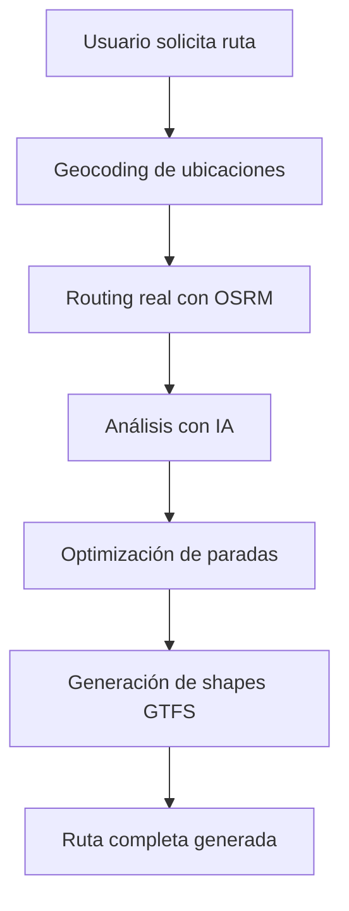
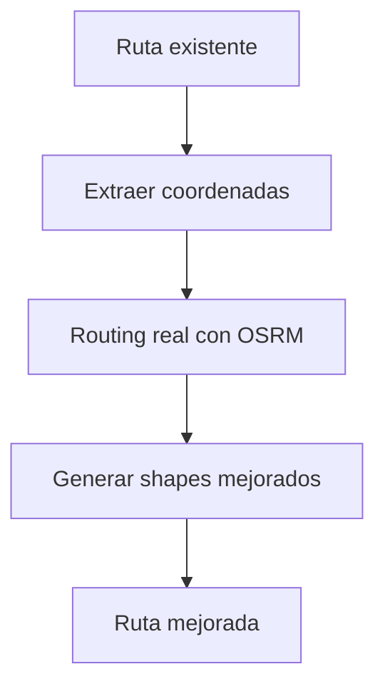

# Integración con OpenStreetMap - GTFS AI Generator

## Descripción

Esta integración combina la inteligencia artificial para la lógica de negocio con datos reales de OpenStreetMap para generar rutas de transporte público realistas que siguen calles existentes.

## Características Principales

### 🔍 Geocoding
- Conversión de direcciones a coordenadas lat/lon
- Geocodificación inversa (coordenadas → dirección)
- Búsqueda de puntos de interés cercanos

### 🛣️ Routing Real
- Cálculo de rutas reales entre puntos usando OSRM
- Soporte para múltiples waypoints
- Diferentes perfiles de routing (driving, walking, etc.)

### 🤖 IA Híbrida
- IA analiza rutas reales para optimizar frecuencias
- IA optimiza paradas basándose en datos reales
- Generación de shapes GTFS compatibles

## APIs Integradas

### OpenStreetMap Nominatim
- **URL**: `https://nominatim.openstreetmap.org`
- **Uso**: Geocoding y reverse geocoding
- **Sin API key requerida**

### OSRM (Open Source Routing Machine)
- **URL**: `http://router.project-osrm.org`
- **Uso**: Cálculo de rutas reales
- **Sin API key requerida**

## Configuración

### Variables de Entorno

```bash
# APIs OSM
OSRM_BASE_URL=http://router.project-osrm.org
NOMINATIM_BASE_URL=https://nominatim.openstreetmap.org
OSM_USER_AGENT=gtfs-ai-generator/1.0

# Configuración de routing
DEFAULT_ROUTING_PROFILE=driving
MAX_WAYPOINTS=25
ROUTING_TIMEOUT=30000
```

### Dependencias

```json
{
  "@turf/distance": "^6.5.0",
  "@turf/helpers": "^6.5.0",
  "polyline": "^0.2.0"
}
```

## Endpoints API

### 1. Generar Ruta Realista

```http
POST /api/osm/generate-realistic-route
Content-Type: application/json

{
  "origin": "Valencia, Estación Central",
  "destination": "Cullera, Plaza Mayor",
  "intermediateStops": ["Alzira Centro", "Sueca Ayuntamiento"],
  "frequency": 30,
  "serviceHours": {
    "start": "06:00",
    "end": "22:00"
  },
  "transportType": "bus",
  "route_short_name": "R1",
  "route_long_name": "Valencia - Cullera",
  "capacity": 50
}
```

**Respuesta:**
```json
{
  "success": true,
  "data": {
    "route": {
      "route_id": "route_1234567890",
      "route_short_name": "R1",
      "route_long_name": "Valencia - Cullera",
      "route_type": 3,
      "route_color": "FF0000"
    },
    "stops": [
      {
        "stop_id": "stop_1",
        "stop_name": "Valencia, Estación Central",
        "stop_lat": 39.4699,
        "stop_lon": -0.3763,
        "stop_sequence": 1
      }
    ],
    "shapes": [
      {
        "shape_id": "shape_1234567890",
        "shape_pt_lat": 39.4699,
        "shape_pt_lon": -0.3763,
        "shape_pt_sequence": 1,
        "shape_dist_traveled": 0
      }
    ],
    "routeData": {
      "distance": 45000,
      "duration": 2700,
      "coordinates": [...]
    },
    "aiAnalysis": {
      "optimalTrips": {
        "totalTrips": 32,
        "justification": "Basado en distancia real y frecuencia deseada"
      }
    }
  }
}
```

### 2. Mejorar Ruta Existente

```http
POST /api/osm/improve-route/route_123
Content-Type: application/json

{
  "route_id": "route_123",
  "stops": [
    {
      "stop_id": "stop_1",
      "stop_lat": 40.4168,
      "stop_lon": -3.7038
    }
  ]
}
```

### 3. Validar Ruta

```http
POST /api/osm/validate-route
Content-Type: application/json

{
  "route_id": "route_123",
  "stops": [...]
}
```

### 4. Geocoding

```http
GET /api/osm/geocode?address=Madrid, España
```

### 5. Reverse Geocoding

```http
GET /api/osm/reverse-geocode?lat=40.4168&lon=-3.7038
```

### 6. Calcular Ruta

```http
POST /api/osm/route
Content-Type: application/json

{
  "coordinates": [
    { "lat": 40.4168, "lon": -3.7038 },
    { "lat": 40.4200, "lon": -3.7100 }
  ],
  "options": {
    "profile": "driving",
    "overview": "full"
  }
}
```

### 7. Buscar POI Cercanos

```http
GET /api/osm/nearby-poi?lat=40.4168&lon=-3.7038&amenity=bus_station&radius=1000
```

### 8. Health Check

```http
GET /api/osm/health
```

## Ejemplos de Uso

### Ejemplo 1: Ruta de Autobús Urbano

```javascript
const routeRequest = {
  origin: "Plaza Mayor, Madrid",
  destination: "Aeropuerto Madrid-Barajas",
  intermediateStops: [
    "Estación de Atocha",
    "Plaza de Castilla"
  ],
  frequency: 15,
  transportType: "bus",
  serviceHours: {
    start: "05:30",
    end: "23:30"
  }
};

const response = await fetch('/api/osm/generate-realistic-route', {
  method: 'POST',
  headers: { 'Content-Type': 'application/json' },
  body: JSON.stringify(routeRequest)
});

const result = await response.json();
console.log('Ruta generada:', result.data);
```

### Ejemplo 2: Ciudad Completa con Rutas Realistas

```javascript
const cityRequest = {
  cityName: "Valencia",
  citySize: "large",
  numberOfRoutes: 8,
  transportTypes: ["bus", "tram"],
  operatingHours: {
    start: "06:00",
    end: "22:00"
  }
};

const response = await fetch('/api/osm/generate-city-realistic', {
  method: 'POST',
  headers: { 'Content-Type': 'application/json' },
  body: JSON.stringify(cityRequest)
});

const city = await response.json();
console.log('Ciudad generada:', city.data);
```

## Testing

### Ejecutar Tests de Integración

```bash
# Test completo de integración OSM
node scripts/test-osm-integration.js

# Test de conectividad básica
curl http://localhost:3000/api/osm/health

# Test de geocoding
curl "http://localhost:3000/api/osm/geocode?address=Madrid, España"
```

### Validar Shapes GTFS

Los shapes generados son compatibles con el estándar GTFS:

```csv
shape_id,shape_pt_lat,shape_pt_lon,shape_pt_sequence,shape_dist_traveled
shape_1,39.4699,-0.3763,1,0
shape_1,39.4700,-0.3764,2,15.2
shape_1,39.4701,-0.3765,3,30.8
```

## Flujo de Trabajo

### 1. Generación de Ruta Realista



### 2. Mejora de Ruta Existente



## Consideraciones Técnicas

### Límites de APIs

- **Nominatim**: 1 request/segundo (respetado automáticamente)
- **OSRM**: Sin límites estrictos, pero se recomienda no abusar
- **Waypoints**: Máximo 25 por ruta (configurable)

### Fallbacks

- Si OSM no responde, se usan rutas sintéticas
- Si geocoding falla, se usan coordenadas aproximadas
- Si routing falla, se usa línea recta entre puntos

### Performance

- Geocoding: ~1-2 segundos por dirección
- Routing: ~2-5 segundos por ruta
- Generación completa: ~10-30 segundos dependiendo de complejidad

## Troubleshooting

### Error: "No se encontraron resultados para geocoding"

**Causa**: Dirección muy específica o inexistente
**Solución**: Usar direcciones más generales (ciudad, barrio)

### Error: "Ruta no válida"

**Causa**: Puntos muy alejados o en el mar
**Solución**: Verificar coordenadas y usar puntos terrestres

### Error: "Timeout en routing"

**Causa**: Ruta muy larga o compleja
**Solución**: Aumentar `ROUTING_TIMEOUT` o dividir en segmentos

## Próximas Mejoras

1. **Caché de rutas**: Evitar recálculos innecesarios
2. **Routing multimodal**: Combinar diferentes tipos de transporte
3. **Análisis de tráfico**: Integrar datos de tráfico en tiempo real
4. **Optimización de paradas**: Algoritmos más sofisticados
5. **Interfaz web**: UI para visualizar rutas generadas

## Contribuir

Para contribuir a esta integración:

1. Fork del repositorio
2. Crear branch para feature
3. Implementar cambios
4. Ejecutar tests: `node scripts/test-osm-integration.js`
5. Crear pull request

## Licencia

Esta integración usa datos de OpenStreetMap bajo licencia ODbL.
